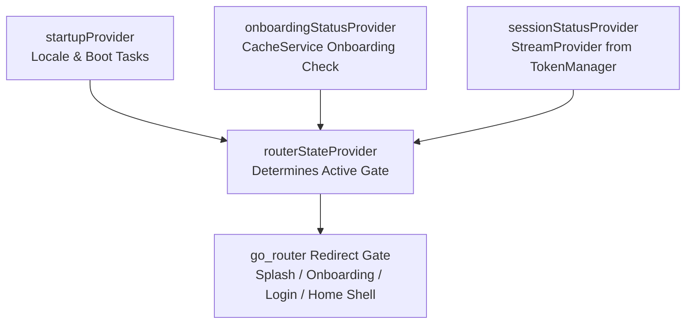

# State Management & Riverpod Data Flow

The application relies on **Riverpod** for declarative dependency injection, reactive application state, and asynchronous data operations.

---

## 1. Application State & Route Gate Composition

Global routing and authorization decisions are derived from an un-opinionated state pipeline:

### Key Application State Providers

| Provider | Type | Purpose |
| :--- | :--- | :--- |
| `startupProvider` | `FutureProvider<void>` | Runs boot sequences (e.g. locale loading). While unresolved, keeps user on Splash. |
| `onboardingStatusProvider` | `Provider<bool>` | Checks if onboarding has been completed via `RouterRepository`. |
| `sessionStatusProvider` | `StreamProvider<SessionStatus>` | Listens to `TokenManager.sessionStream` via `RouterRepository` to react to auth/logout events in real time. |
| `routerStateProvider` | `Provider<RouterState>` | Combines Startup, Onboarding, and Session states into a single route gate enum. |
| `themeModeProvider` | `AsyncNotifier<ThemeMode>` | Reactively loads, toggles, and persists `ThemeMode.light`, `ThemeMode.dark`, or `ThemeMode.system`. |
| `localizationProvider` | `Notifier<Locale>` | Tracks the active application locale and triggers UI rebuilds upon language change. |

---

## 2. Feature-Level State Patterns

* **Repository Access**: Screen view models read repository contracts via providers (e.g., `ref.watch(authRepositoryProvider)`).
* **UI State Modeling**: View models expose sealed classes or immutable state data (e.g., `AsyncValue<T>` or custom states with `status`, `errorMessage`, `data`).
* **Clean Build Methods**: Widgets strictly use `ref.watch` to rebuild upon state changes, avoiding imperative `ref.read` calls inside `Widget.build`.
