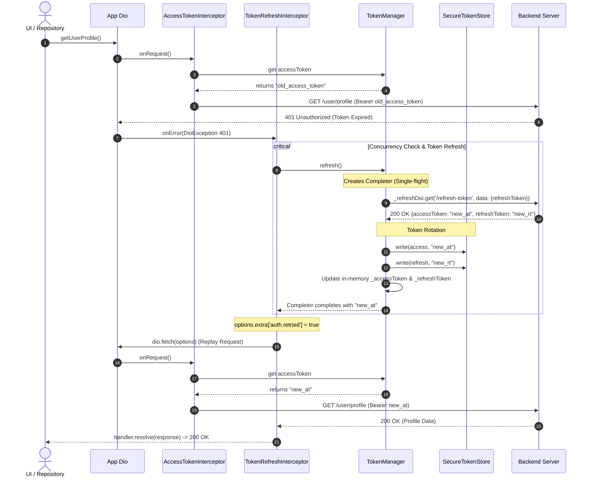

# Token Refresh & Rotation Architecture

This document details how [TokenManager](../../lib/src/data/services/network/auth/token_manager.dart) and [TokenRefreshInterceptor](../../lib/src/data/services/network/interceptors/token_refresh_interceptor.dart) interact to achieve secure token attachment, single-flight token refreshing, and atomic token rotation.

---

## 1. High-Level Architecture & Responsibilities

```text
 ┌───────────────────────────┐         ┌───────────────────────────┐
 │  AccessTokenInterceptor   │         │  TokenRefreshInterceptor  │
 │  Attaches Bearer Token    │         │  Catches 401 & Replays    │
 └─────────────┬─────────────┘         └─────────────┬─────────────┘
               │                                     │
               │ reads token                         │ calls refresh()
               ▼                                     ▼
 ┌─────────────────────────────────────────────────────────────────┐
 │                          TokenManager                           │
 │  • Single Source of Truth for Tokens (Memory & Secure Storage)  │
 │  • Single-Flight Mutex (Completer) for concurrent requests      │
 │  • Isolated `_refreshDio` (Prevents Interceptor Infinite Loops) │
 │  • Token Rotation (Saves new Access + Refresh tokens)           │
 └─────────────────┬───────────────────────────────┬───────────────┘
                   │ persists                      │ calls endpoint
                   ▼                               ▼
       ┌───────────────────────┐       ┌───────────────────────┐
       │   SecureTokenStore    │       │     Backend API       │
       │   Encrypted Storage   │       │  /api/v1/auth/refresh │
       └───────────────────────┘       └───────────────────────┘
```

| Component | Responsibility |
| :--- | :--- |
| **`AccessTokenInterceptor`** | Injects `Authorization: Bearer <accessToken>` into every outgoing request. |
| **`TokenRefreshInterceptor`** | Intercepts `401 Unauthorized`, verifies eligibility, delegates refresh to `TokenManager`, and replays the original request. |
| **`TokenManager`** | Single source of truth. Manages in-memory cache + `TokenStore`, deduplicates concurrent refresh calls via `Completer`, executes the refresh HTTP request using an isolated `Dio` instance (`_refreshDio`), and handles token rotation. |

---

## 2. End-to-End Workflow Diagram (Eraser Style)

```text
┌─────────────────────────────────────────────────────────────────────────────────────────────────────────────┐
│ 1. API REQUEST FAILS                                                                                        │
│                                                                                                             │
│  ┌─────────────────────────┐     GET /user/profile      ┌─────────────────────────┐                         │
│  │     Dio HTTP Client     │ ─────────────────────────► │       Backend API       │                         │
│  │ (AccessTokenInterceptor)│ ◄───────────────────────── │  401 Token Expired      │                         │
│  └────────────┬────────────┘                            └─────────────────────────┘                         │
│               │                                                                                             │
│               ▼ passes 401 error                                                                            │
│  ┌─────────────────────────┐                                                                                │
│  │ TokenRefreshInterceptor │ ───► Is request eligible? (has auth header, not retried yet, not FormData)     │
│  └────────────┬────────────┘                                                                                │
└───────────────┼─────────────────────────────────────────────────────────────────────────────────────────────┘
                │
                ▼
┌─────────────────────────────────────────────────────────────────────────────────────────────────────────────┐
│ 2. SINGLE-FLIGHT REFRESH & TOKEN ROTATION                                                                   │
│                                                                                                             │
│               ┌────────────────────────────────────────┐                                                    │
│               │              TokenManager              │                                                    │
│               │  Checks `_inflightRefresh` Completer   │                                                    │
│               └───────────────────┬────────────────────┘                                                    │
│                                   │                                                                         │
│         ┌─────────────────────────┴────────────────────────┐                                                │
│         │ If refresh already running                       │ If first request (starts refresh)              │
│         ▼                                                  ▼                                                │
│  ┌─────────────────────────┐                    ┌─────────────────────────┐                                 │
│  │  Wait for same Future   │                    │     _refreshDio.get     │                                 │
│  │  (No duplicate HTTP)    │                    │   /auth/refresh-token   │                                 │
│  └────────────┬────────────┘                    └────────────┬────────────┘                                 │
│               │                                              │                                              │
│               │                                              ▼ returns: {accessToken, refreshToken}         │
│               │                                 ┌─────────────────────────┐                                 │
│               │                                 │   Save & Rotate Tokens  │                                 │
│               │                                 │  • Write to SecureStore │                                 │
│               │                                 │  • Update In-Memory     │                                 │
│               │                                 └────────────┬────────────┘                                 │
│               │                                              │                                              │
│               └──────────────────────┬───────────────────────┘                                              │
│                                      │                                                                      │
│                                      ▼ completes with new Access Token                                      │
└──────────────────────────────────────┼──────────────────────────────────────────────────────────────────────┘
                                       │
                                       ▼
┌─────────────────────────────────────────────────────────────────────────────────────────────────────────────┐
│ 3. REPLAY FAILED REQUEST                                                                                    │
│                                                                                                             │
│  ┌─────────────────────────┐   replay via dio.fetch()   ┌─────────────────────────┐                         │
│  │ TokenRefreshInterceptor │ ─────────────────────────► │       Backend API       │                         │
│  │ (sets auth.retried=true)│                            │    200 OK (Success)     │                         │
│  └────────────┬────────────┘ ◄───────────────────────── └─────────────────────────┘                         │
│               │                                                                                             │
│               ▼ handler.resolve(response)                                                                   │
│  ┌─────────────────────────┐                                                                                │
│  │  Caller receives 200 OK │  (Original caller never knew token had expired)                                │
│  └─────────────────────────┘                                                                                │
└─────────────────────────────────────────────────────────────────────────────────────────────────────────────┘
```

---

## 3. Detailed Sequence Diagram



---

## 4. Key Mechanisms Explained

### 1. Single-Flight Concurrency (`Completer`)
If 5 requests hit 401 simultaneously:
* The 1st request creates `_inflightRefresh = Completer<String>()` and triggers `_runRefresh`.
* Requests 2 through 5 see `_inflightRefresh != null` and simply await `existing.future`.
* When the refresh finishes, **all 5 requests resolve simultaneously from that single network roundtrip**.

### 2. Stale Token Fast-Path (`_tokenIsStale`)
If request A refreshed the token while request B was in-flight:
* When request B gets its 401, it calls `_tokenIsStale(err.requestOptions)`.
* Since `TokenManager._accessToken` is already newer than the header in request B, request B **skips calling refresh** and immediately replays with the new token.

### 3. Token Rotation
* When the backend returns both a new `accessToken` and a rotated `refreshToken`, `TokenManager` writes both to `SecureTokenStore` and updates memory.
* If the backend only returns an `accessToken`, the existing `refreshToken` is preserved.

### 4. Isolated `_refreshDio`
* `TokenManager` uses its own dedicated `Dio` instance without interceptors. This guarantees that if the refresh endpoint returns 401, it does not trigger `TokenRefreshInterceptor` in an infinite loop.

### 5. Retry Guard (`_retriedKey: 'auth.retried'`)
* Marks retried requests with `options.extra['auth.retried'] = true`.
* If a replayed request fails with 401 again (e.g., user permissions revoked), `_eligible()` returns `false`, preventing endless replay loops.

### 6. Definitive Session Invalidation vs Network Outages (`_isAuthDefinitive`)
* Only definitive auth errors (400, 401, 403, or invalid token payload) invoke `clearSession()`.
* Server 500s, connection timeouts, or offline errors leave the session intact so the user isn't logged out unnecessarily due to transient network glitches.
